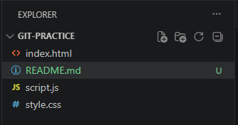

# Git Practice Project 🚀

A simple web project built while learning Git and GitHub.

---

## 📸 Preview



---

## ✨ Features

- Basic HTML structure
- Custom CSS styling
- Dark mode styles
- Navigation section

---

## 🛠️ Tech Stack

- HTML5
- CSS3

---

## 🚀 How to Run Locally

Follow these steps to run this project on your machine:

1. Clone the repository
```bash
git clone https://github.com/apatheticdev-saad/git-practice.git
```

2. Enter the project folder
```bash
cd git-practice
```

3. Open index.html in your browser
```bash
start index.html
```
That's it! No installation needed.

---

## 🔗 Live Demo

[Click here to view live](#) ← replace # with your live URL if deployed

---

## 👤 Author

**Saad**
- GitHub: [@apatheticdev-saad](https://github.com/apatheticdev-saad)

---

## 📄 License

This project is open source and available for anyone to use.